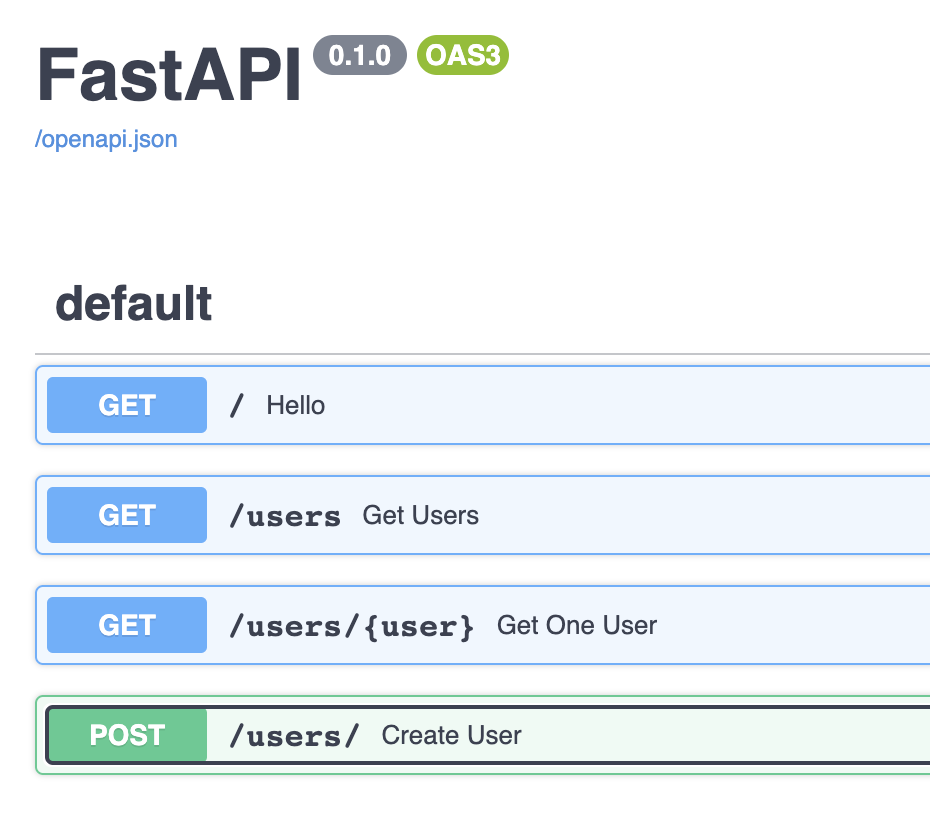
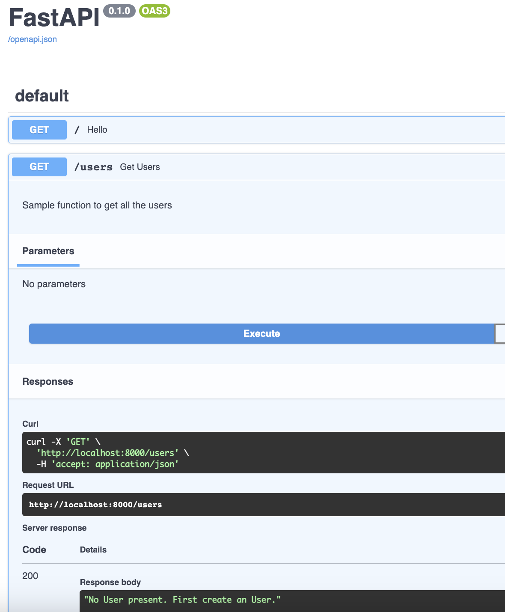
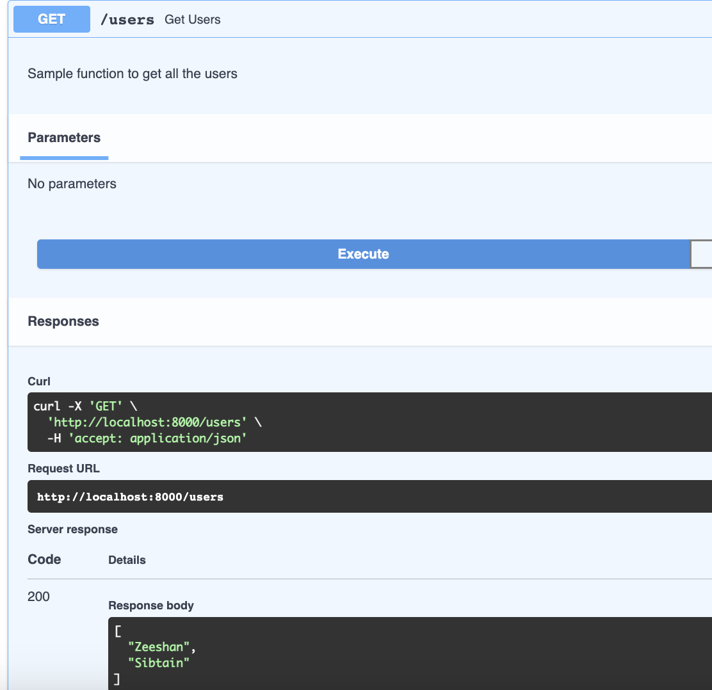
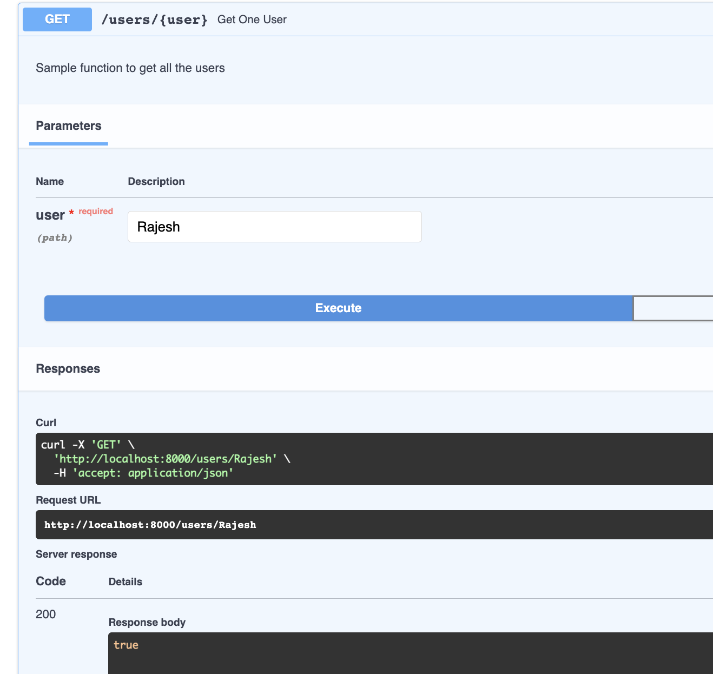

# FastAPI Basics

### Install FastAPI
> pip install fastapi[all]

### Basic App
Save with the name `main.py`
```
from fastapi import FastAPI

app = FastAPI()


@app.get("/")
async def hello():
    """Sample Startup Function"""
    return "Hello FastAPI"

```
### Start App
> uvicorn main:app



### Get Users, when no users present


### Get Users, when users present


### Get Specific User


### Create User

